# User Research Multi-Agent System - Workflow Documentation

## Overview

This document provides comprehensive workflow documentation for the User Research Multi-Agent System, featuring 5 specialized research workflows that coordinate 6 research agents to deliver high-quality user insights.

### Agent Team Structure

```mermaid
graph TB
    RO[Research Orchestrator<br/>🎯 Project Management & Coordination]
    RS[Research Strategist<br/>📋 Study Design & Planning]
    IS[Interview Specialist<br/>🎤 Data Collection & Interviews]
    DA[Data Analyst<br/>📊 Analysis & Coding]
    ISY[Insight Synthesizer<br/>💡 Synthesis & Sensemaking]
    RR[Research Reporter<br/>📄 Reporting & Communication]

    RO --> RS
    RS --> IS
    IS --> DA
    DA --> ISY
    ISY --> RR
    RR --> RO

    style RO fill:#e1f5fe,stroke:#01579b,stroke-width:2px
    style RS fill:#f3e5f5,stroke:#4a148c,stroke-width:2px
    style IS fill:#e8f5e8,stroke:#1b5e20,stroke-width:2px
    style DA fill:#fff3e0,stroke:#e65100,stroke-width:2px
    style ISY fill:#fce4ec,stroke:#880e4f,stroke-width:2px
    style RR fill:#f1f8e9,stroke:#33691e,stroke-width:2px
```



## Workflow Overview Matrix

| Workflow | Duration | Team Size | Primary Use Case | Key Outputs |
|----------|----------|-----------|------------------|-------------|
| **User Interview Research** | 3-6 weeks | 2-4 researchers | Comprehensive user insights | Personas, Journey Maps, Requirements |
| **Rapid Discovery** | 5 days | 2-3 researchers | Quick insights for urgent decisions | Top insights, Quick wins |
| **Conjoint Analysis** | 2-3 weeks | 2-3 researchers + analyst | Preference & trade-off analysis | Utility scores, Market simulations |
| **Ethnographic Research** | 4-8 weeks | 2-3 researchers | Deep cultural & behavioral insights | Thick descriptions, Cultural patterns |
| **Mixed Methods Research** | 4-6 weeks | 3-4 researchers | Holistic understanding (qual + quant) | Validated findings, Integrated model |

---

# 1. User Interview Research Workflow

## High-Level Flow


## Detailed Phase Breakdown


## Agent Handoffs & Data Flow


## Error Handling & Recovery


---

# 2. Rapid Discovery Sprint Workflow

## Sprint Overview


## Sprint Flow with Decision Points


## Rapid Techniques & Quality Trade-offs


---

# 3. Conjoint Analysis Workflow

## Research Design Process


## Attribute & Level Design


## Statistical Analysis Flow


---

# 4. Ethnographic Research Workflow

## Field Work Process


## Ethnographic Data Types & Analysis


## Quality Criteria (Lincoln & Guba)


---

# 5. Mixed Methods Research Workflow

## Integration Strategy


## Integration Techniques

```mermaid
graph TB
    subgraph "Data Transformation"
        DT1[Qualitizing<br/>Quant → Qual]
        DT2[Quantitizing<br/>Qual → Quant]
        DT3[Data Consolidation<br/>Merge datasets]
        DT4[Data Comparison<br/>Side-by-side]
    end

    subgraph "Analysis Integration"
        AI1[Sequential Explanatory<br/>Quant → Qual]
        AI2[Sequential Exploratory<br/>Qual → Quant]
        AI3[Concurrent Triangulation<br/>Parallel comparison]
        AI4[Concurrent Nested<br/>One embedded in other]
    end

    subgraph "Interpretation Methods"
        IM1[Narrative Weaving<br/>Integrated story]
        IM2[Joint Displays<br/>Side-by-side tables]
        IM3[Data Matrices<br/>Convergence grids]
        IM4[Mixed Tables<br/>Quan → Qual → Meta]
    end

    DT1 --> AI1
    DT2 --> AI2
    DT3 --> AI3
    DT4 --> AI4

    AI1 --> IM1
    AI2 --> IM2
    AI3 --> IM3
    AI4 --> IM4

    style DT1 fill:#e3f2fd,stroke:#1976d2,stroke-width:2px
    style DT2 fill:#e3f2fd,stroke:#1976d2,stroke-width:2px
    style DT3 fill:#e3f2fd,stroke:#1976d2,stroke-width:2px
    style DT4 fill:#e3f2fd,stroke:#1976d2,stroke-width:2px
    style IM1 fill:#e8f5e8,stroke:#388e3c,stroke-width:2px
    style IM2 fill:#e8f5e8,stroke:#388e3c,stroke-width:2px
    style IM3 fill:#e8f5e8,stroke:#388e3c,stroke-width:2px
    style IM4 fill:#e8f5e8,stroke:#388e3c,stroke-width:2px
```



## Convergence Analysis Matrix

```mermaid
graph LR
    subgraph "Qualitative Findings"
        QF1[Theme A: User Frustration]
        QF2[Theme B: Feature Importance]
        QF3[Theme C: Context Usage]
    end

    subgraph "Quantitative Results"
        QR1[85% report difficulties]
        QR2[Feature X highest rated]
        QR3[Mobile usage patterns]
    end

    subgraph "Integration Status"
        IS1[✓ CONVERGENT<br/>Strong agreement]
        IS2[✓ CONVERGENT<br/>Aligned priorities]
        IS3[~ PARTIAL<br/>Need clarification]
    end

    QF1 --> IS1
    QR1 --> IS1
    QF2 --> IS2
    QR2 --> IS2
    QF3 --> IS3
    QR3 --> IS3

    style IS1 fill:#c8e6c9,stroke:#4caf50,stroke-width:2px
    style IS2 fill:#c8e6c9,stroke:#4caf50,stroke-width:2px
    style IS3 fill:#fff3e0,stroke:#ff9800,stroke-width:2px
```



---

# Cross-Workflow Analysis

## Methodology Selection Decision Tree


## Quality Gates Across Workflows


---

# Technical Implementation Details

## Agent Communication Protocol


## Error Escalation Hierarchy

```mermaid
graph TD
    TaskLevel[Task Level Error<br/>Response: 1 hour<br/>Owner: Agent] --> PhaseLevel{Resolved?}
    PhaseLevel -->|No| PhaseEscalate[Phase Level Error<br/>Response: 4 hours<br/>Owner: Orchestrator]
    PhaseLevel -->|Yes| Resolved[Error Resolved]

    PhaseEscalate --> ProjectLevel{Resolved?}
    ProjectLevel -->|No| ProjectEscalate[Project Level Error<br/>Response: Immediate<br/>Owner: Research Lead]
    ProjectLevel -->|Yes| Resolved

    ProjectEscalate --> Decision{Decision}
    Decision -->|Continue| AdjustPlan[Adjust Project Plan]
    Decision -->|Abort| ProjectStop[Project Terminated]
    Decision -->|Modify| ChangeScope[Change Scope/Timeline]

    AdjustPlan --> Resolved
    ChangeScope --> Resolved

    style TaskLevel fill:#fff3e0,stroke:#f57c00,stroke-width:2px
    style PhaseEscalate fill:#ffeb3b,stroke:#f57f17,stroke-width:2px
    style ProjectEscalate fill:#f44336,stroke:#c62828,stroke-width:2px
    style Resolved fill:#4caf50,stroke:#2e7d32,stroke-width:2px
    style ProjectStop fill:#ffcdd2,stroke:#d32f2f,stroke-width:2px
```

## Data Lineage & Traceability

```mermaid
flowchart LR
    subgraph "Raw Data"
        RD1[Interview Recordings]
        RD2[Survey Responses]
        RD3[Observation Notes]
        RD4[Cultural Artifacts]
    end

    subgraph "Processed Data"
        PD1[Transcripts JSON]
        PD2[Cleaned Dataset]
        PD3[Coded Field Notes]
        PD4[Artifact Catalog]
    end

    subgraph "Analysis Outputs"
        AO1[Themes & Patterns]
        AO2[Statistical Results]
        AO3[Cultural Models]
        AO4[Integrated Insights]
    end

    subgraph "Final Deliverables"
        FD1[Research Report]
        FD2[Personas]
        FD3[Journey Maps]
        FD4[Recommendations]
    end

    RD1 --> PD1 --> AO1 --> FD1
    RD2 --> PD2 --> AO2 --> FD2
    RD3 --> PD3 --> AO3 --> FD3
    RD4 --> PD4 --> AO4 --> FD4

    %% Cross-connections for mixed methods
    AO1 -.-> AO4
    AO2 -.-> AO4
    AO3 -.-> AO4

    style RD1 fill:#e3f2fd,stroke:#1976d2,stroke-width:2px
    style RD2 fill:#e3f2fd,stroke:#1976d2,stroke-width:2px
    style RD3 fill:#e3f2fd,stroke:#1976d2,stroke-width:2px
    style RD4 fill:#e3f2fd,stroke:#1976d2,stroke-width:2px
    style FD1 fill:#e8f5e8,stroke:#388e3c,stroke-width:2px
    style FD2 fill:#e8f5e8,stroke:#388e3c,stroke-width:2px
    style FD3 fill:#e8f5e8,stroke:#388e3c,stroke-width:2px
    style FD4 fill:#e8f5e8,stroke:#388e3c,stroke-width:2px
```

---

# Workflow Comparison Matrix

| Aspect | User Interview | Rapid Discovery | Conjoint Analysis | Ethnographic | Mixed Methods |
|--------|----------------|-----------------|-------------------|--------------|---------------|
| **Duration** | 3-6 weeks | 5 days | 2-3 weeks | 4-8 weeks | 4-6 weeks |
| **Sample Size** | 12-20 | 8-10 | 200+ | 10-20 | 15-25 + 200+ |
| **Primary Output** | Personas, Journey Maps | Quick insights | Utility scores | Cultural patterns | Validated insights |
| **Quality Focus** | Comprehensive | Speed | Statistical rigor | Cultural validity | Triangulation |
| **Error Tolerance** | Low | Medium | Very Low | Low | Low |
| **Automation Level** | High | Very High | Medium | Low | Medium |
| **Stakeholder Involvement** | Moderate | High | Low | Low | High |
| **Skill Requirements** | UX Research | UX Research | Statistics | Anthropology | Multi-disciplinary |

---

# Success Metrics & KPIs

## Workflow Performance Metrics

```mermaid
graph TB
    subgraph "Efficiency Metrics"
        EM1[Time to Completion<br/>vs. Estimated Duration]
        EM2[Resource Utilization<br/>% of Allocated Budget]
        EM3[Error Rate<br/>Errors per Phase]
        EM4[Rework Frequency<br/>Quality Gate Failures]
    end

    subgraph "Quality Metrics"
        QM1[Stakeholder Satisfaction<br/>Score >4/5]
        QM2[Insight Actionability<br/>Implementation Rate]
        QM3[Data Quality<br/>Accuracy & Completeness]
        QM4[Recommendation Uptake<br/>% Accepted by Stakeholders]
    end

    subgraph "Impact Metrics"
        IM1[Business Decision Support<br/>Decisions Enabled]
        IM2[User Understanding<br/>Knowledge Gained]
        IM3[Product Improvement<br/>Changes Implemented]
        IM4[Strategic Alignment<br/>Goal Achievement]
    end

    EM1 --> QM1
    EM2 --> QM2
    EM3 --> QM3
    EM4 --> QM4

    QM1 --> IM1
    QM2 --> IM2
    QM3 --> IM3
    QM4 --> IM4

    style EM1 fill:#e3f2fd,stroke:#1976d2,stroke-width:2px
    style EM2 fill:#e3f2fd,stroke:#1976d2,stroke-width:2px
    style EM3 fill:#e3f2fd,stroke:#1976d2,stroke-width:2px
    style EM4 fill:#e3f2fd,stroke:#1976d2,stroke-width:2px
    style QM1 fill:#fff3e0,stroke:#f57c00,stroke-width:2px
    style QM2 fill:#fff3e0,stroke:#f57c00,stroke-width:2px
    style QM3 fill:#fff3e0,stroke:#f57c00,stroke-width:2px
    style QM4 fill:#fff3e0,stroke:#f57c00,stroke-width:2px
    style IM1 fill:#e8f5e8,stroke:#388e3c,stroke-width:2px
    style IM2 fill:#e8f5e8,stroke:#388e3c,stroke-width:2px
    style IM3 fill:#e8f5e8,stroke:#388e3c,stroke-width:2px
    style IM4 fill:#e8f5e8,stroke:#388e3c,stroke-width:2px
```

---

# Conclusion

This User Research Multi-Agent System provides a comprehensive framework for conducting high-quality research across multiple methodologies. The system's strength lies in its:

1. **Systematic Approach**: Each workflow follows established research best practices with clear quality gates
2. **Flexibility**: Five different approaches to match various research needs and constraints
3. **Quality Assurance**: Built-in error handling, validation, and recovery mechanisms
4. **Coordination**: Seamless agent handoffs with standardized artifact specifications
5. **Measurable Outcomes**: Clear success metrics and continuous improvement feedback loops

The workflows are designed to be both rigorous and practical, enabling research teams to deliver actionable insights that drive informed decision-making and user-centered design.