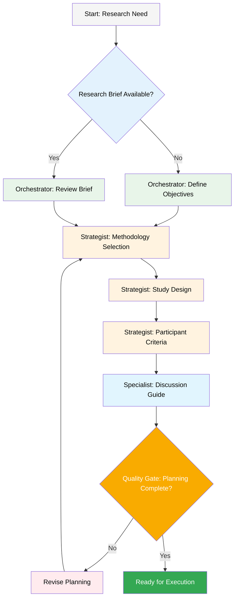
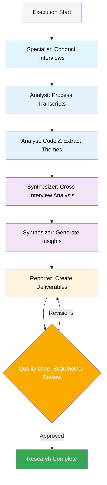
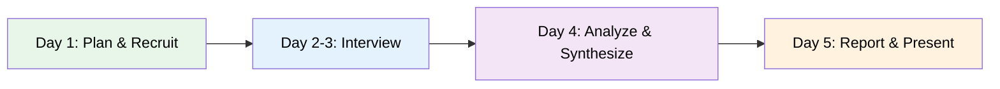

# User Research Multi-Agent System — User Guide

*This guide will help you understand and effectively use the User Research Multi-Agent System for end-to-end research orchestration*

## The User Research Planning and Execution Workflow

The User Research Multi-Agent System provides a comprehensive platform for conducting user research from initial planning through final delivery. The system orchestrates 6 specialized agents through 5 distinct research workflows, maintaining rigorous quality standards throughout.

If you're new to the system, start with the **Rapid Discovery** workflow to understand the core capabilities before attempting more complex methodologies.

### The Research Planning Workflow

Before research begins, the system follows a structured planning workflow:



### The Core Research Execution Cycle

Once planning is complete, the system follows structured execution workflows:



## Prerequisites

Before using the User Research System, ensure you have:

- **Access to research participants** or recruitment channels
- **Research objectives** clearly defined
- **Stakeholder alignment** on research goals
- **Time allocation**: 5 days (rapid) to 8 weeks (ethnographic)
- **Team availability** for elicitation sessions

## Installation & Setup

### System Access

```bash
# Load the research orchestrator
*research-orchestrator

# Or load a specific team configuration
*team-all          # Complete research team
*team-minimal      # Rapid discovery team
*team-qualitative  # Interview & ethnography team
*team-quantitative # Survey & statistics team
*team-mixed        # Combined methods team
```

### Research Artifacts (Standard Paths)

```text
Research Brief      → docs/research/brief.md
Study Design        → docs/research/study-design.md
Discussion Guide    → docs/research/discussion-guide.md
Transcripts         → data/transcripts/
Analysis            → data/analysis/
Reports             → docs/research/reports/
Presentations       → docs/research/presentations/
```

## Special Agents

The User Research System includes 6 specialized agents, each with deep expertise in specific aspects of the research process.

### Research Orchestrator (Dr. Morgan) 🎯

**Chief Research Orchestrator** - The master coordinator who ensures research quality and alignment across all phases.

#### Quick Start (Essential Commands)

```bash
*help                  # Show available commands
*initiate-project      # Start new research project
*select-methodology    # Choose research approach
*assign-agents         # Delegate to specialists
*review-gates          # Check quality standards
*generate-summary      # Create executive summary
```

#### Core Capabilities

1. **Project Initiation** (`*initiate-project`)
   - **When**: Starting any new research project
   - **Process**: 4-stage mandatory elicitation (objectives → stakeholders → resources → scope)
   - **Output**: `docs/research/brief.md`
   - **Quality Gate**: Stakeholder approval >75%

2. **Methodology Selection** (`*select-methodology`)
   - **When**: After objectives defined, before study design
   - **Process**: Systematic evaluation across 5 weighted criteria
   - **Decision Framework**:
     - Exploratory → Qualitative methods
     - Descriptive → Quantitative methods
     - Explanatory → Mixed methods
   - **Output**: `docs/research/methodology-matrix.md`

3. **Agent Coordination** (`*assign-agents`)
   - Delegates specific tasks to specialized agents
   - Maintains research context throughout handoffs
   - Validates deliverables against objectives

4. **Quality Gates** (`*review-gates`)
   - Enforces standards at each phase transition
   - References: `checklists/research-quality-checklist.md`
   - Minimum thresholds: IRR >0.7, Completion >95%, Stakeholder satisfaction >4/5

#### Dependencies
- **Templates**: research-brief-tmpl.yaml, methodology-matrix-tmpl.yaml
- **Tasks**: establish-research-project.md, select-research-methodology.md
- **Data**: research-methods-kb.md, ethical-guidelines.md
- **Checklists**: research-quality-checklist.md

### Research Strategist (Dr. Sarah) 🔬

**Senior Research Strategist** - Expert in study design, sampling strategies, and advanced methodologies.

#### Quick Start (Essential Commands)

```bash
*design-study          # Create comprehensive study design
*create-screener       # Build participant screener
*calculate-sample      # Determine sample size
*design-conjoint       # Setup conjoint analysis
*plan-ethnography      # Design field research
```

#### Core Capabilities

1. **Study Design** (`*design-study`)
   - **When**: After methodology selection, before data collection
   - **Process**: 6-phase elicitation covering all study aspects
   - **Quality Standards**:
     - All research questions have collection methods
     - Sample size provides adequate confidence
     - Timeline includes 20-25% buffers
   - **Output**: `docs/research/study-design.md`

2. **Participant Screening** (`*create-screener`)
   - **When**: Before recruitment begins
   - **Process**: 4-level progressive filtering
   - **Quality Targets**:
     - False positive rate <5%
     - False negative rate <10%
     - Completion time 3-5 minutes
   - **Output**: `docs/research/screening-questionnaire.md`

3. **Advanced Methods**
   - **Conjoint Analysis**: D-efficiency >0.85, 4-7 attributes
   - **Ethnographic Studies**: 2-8 weeks field work planning
   - **Mixed Methods**: Integration planning for convergent/sequential designs

#### Dependencies
- **Templates**: study-design-tmpl.yaml, screening-criteria-tmpl.yaml, conjoint-setup-tmpl.yaml
- **Tasks**: design-research-study.md, create-screening-questionnaire.md, setup-conjoint-analysis.md
- **Data**: sampling-methods.md, statistical-power.md

### Interview Specialist (Jamie) 🎤

**Lead Interview Specialist** - Master of elicitation techniques and conversation design.

#### Quick Start (Essential Commands)

```bash
*create-guide          # Generate discussion guide
*generate-probes       # Create follow-up questions
*simulate-interview    # Practice interview session
*create-protocol       # Build execution protocol
```

#### Core Capabilities

1. **Discussion Guide Creation** (`*create-guide`)
   - **When**: After study design, before interviews
   - **Process**: 11-point elicitation for comprehensive guide
   - **Sections**: Opening → Context → Core → Deep Dive → Future → Closing
   - **Quality**: Bias-free questions, logical flow
   - **Output**: `docs/research/discussion-guide.md`

2. **Interview Protocols** (`*create-protocol`)
   - Pre-interview preparation checklist
   - Recording quality standards (>95% accuracy)
   - Consent and ethical procedures
   - Post-interview processing requirements

#### Dependencies
- **Templates**: discussion-guide-tmpl.yaml, interview-protocol-tmpl.yaml, probe-bank-tmpl.yaml
- **Tasks**: create-discussion-guide.md, generate-interview-probes.md
- **Data**: interview-techniques.md, cognitive-biases.md, rapport-building.md

### Data Analyst (Alex) 📊

**Senior Research Analyst** - Expert in qualitative and quantitative analysis.

#### Quick Start (Essential Commands)

```bash
*analyze-transcript    # Process interview transcripts
*extract-themes        # Identify recurring patterns
*create-affinity       # Build affinity diagrams
*calculate-stats       # Statistical analysis
*sentiment-analysis    # Emotional pattern analysis
```

#### Core Capabilities

1. **Transcript Analysis** (`*analyze-transcript`)
   - **When**: After interview transcription
   - **Process**: 5-pass systematic coding
   - **Quality Standards**:
     - Inter-rater reliability >0.70
     - Code coverage >95%
     - Saturation documented
   - **Output**: Coded transcripts in JSON format

2. **Theme Extraction** (`*extract-themes`)
   - Pattern identification across interviews
   - Theme hierarchy development
   - Evidence linking (minimum 3 sources per theme)

3. **Statistical Analysis** (`*calculate-stats`)
   - Descriptive and inferential statistics
   - Effect size calculations
   - Significance testing with corrections

#### Dependencies
- **Templates**: transcript-analysis-tmpl.yaml, coding-framework-tmpl.yaml, affinity-map-tmpl.yaml
- **Tasks**: analyze-transcript.md, extract-themes.md, create-affinity-diagram.md
- **Data**: coding-frameworks.md, analysis-methods.md, statistical-tests.md

### Insight Synthesizer (Dr. Riley) 💡

**Principal Insight Synthesizer** - Transforms data into actionable strategic insights.

#### Quick Start (Essential Commands)

```bash
*synthesize            # Cross-interview synthesis
*requirements          # Extract user requirements
*personas              # Create user personas
*journey               # Map customer journey
*jtbd                  # Identify jobs-to-be-done
*opportunities         # Find innovation opportunities
```

#### Core Capabilities

1. **Cross-Interview Synthesis** (`*synthesize`)
   - **When**: After individual analysis complete
   - **Process**: 5-stage integration process
   - **Quality**: Minimum 3 data sources per insight
   - **Output**: `docs/research/synthesis.md`

2. **Persona Development** (`*personas`)
   - Evidence-based characteristics
   - Behavioral patterns and motivations
   - Validation through member checking

3. **Strategic Outputs**
   - User requirements matrix
   - Customer journey maps
   - Jobs-to-be-done framework
   - Innovation opportunity areas

#### Dependencies
- **Templates**: synthesis-framework-tmpl.yaml, persona-profile-tmpl.yaml, journey-map-tmpl.yaml
- **Tasks**: synthesize-cross-interview.md, create-user-personas.md, map-customer-journey.md
- **Data**: persona-frameworks.md, jtbd-methodology.md

### Research Reporter (Taylor) 📝

**Lead Research Reporter** - Expert in research communication and visualization.

#### Quick Start (Essential Commands)

```bash
*generate-report       # Create comprehensive report
*create-summary        # Executive summary
*design-visuals        # Data visualizations
*draft-recommendations # Strategic recommendations
*create-presentation   # Stakeholder deck
```

#### Core Capabilities

1. **Report Generation** (`*generate-report`)
   - **When**: After synthesis complete
   - **Formats**: Technical (20-50 pages), Executive (2-5 pages)
   - **Sections**: Executive Summary → Methods → Findings → Insights → Recommendations
   - **Quality**: WCAG AA compliant, evidence-based

2. **Stakeholder Communication** (`*create-summary`)
   - Audience-specific versions (C-level, Product, Design, Engineering)
   - Visual storytelling with infographics
   - Action-oriented recommendations

3. **Deliverable Formats**
   - Comprehensive research reports
   - Executive summaries
   - Presentation decks
   - Quick-win documents
   - Implementation roadmaps

#### Dependencies
- **Templates**: research-report-tmpl.yaml, executive-summary-tmpl.yaml, visualization-specs-tmpl.yaml
- **Tasks**: generate-research-report.md, create-executive-summary.md, design-visualizations.md
- **Data**: visualization-guidelines.md, reporting-standards.md

## Research Workflows

### Overview

The system provides 5 distinct research workflows, each optimized for specific research needs:

| **Workflow** | **Duration** | **Best For** | **Key Output** |
|--------------|--------------|--------------|----------------|
| **Rapid Discovery** | 5 days | Quick insights, urgent decisions | Action-oriented findings |
| **User Interview** | 3-6 weeks | Deep behavioral understanding | Comprehensive insights |
| **Conjoint Analysis** | 2-3 weeks | Feature/pricing preferences | Statistical preference models |
| **Ethnographic** | 4-8 weeks | Cultural/contextual insights | Rich narratives & patterns |
| **Mixed Methods** | 4-6 weeks | Validation & triangulation | Integrated insights |

### 1. Rapid Discovery Workflow (`*workflow rapid-discovery`)

**5-Day Sprint for Quick Insights**



**Daily Breakdown**:
- **Day 1**: Define objectives, create guide, recruit 8-10 participants
- **Day 2-3**: Conduct interviews (30-45 min each), daily synthesis
- **Day 4**: Rapid coding, affinity mapping, insight generation
- **Day 5**: Create presentation, stakeholder readout, action planning

**Quality Trade-offs**:
- Single-pass coding (vs. multi-round)
- Top-line themes (vs. deep analysis)
- Presentation format (vs. full report)

### 2. User Interview Research Workflow (`*workflow user-interview-research`)

**Comprehensive Qualitative Research**

**Phases**:
1. **Planning** (3-4 days): Objectives, methodology, study design
2. **Preparation** (2-3 days): Guide creation, recruitment, logistics
3. **Collection** (5-10 days): Interviews, transcription, field notes
4. **Analysis** (4-5 days): Coding, theme extraction, affinity mapping
5. **Synthesis** (3-4 days): Cross-interview patterns, personas
6. **Reporting** (3-4 days): Report, presentation, recommendations
7. **Delivery** (1-2 days): Stakeholder presentations, Q&A

**Quality Standards**:
- Inter-rater reliability >0.70
- Minimum 12-15 participants for saturation
- Evidence chain from data to insights

### 3. Conjoint Analysis Workflow (`*workflow conjoint-analysis`)

**Quantitative Preference Research**

**Technical Requirements**:
- 4-7 attributes with 2-5 levels each
- 200+ respondents for statistical power
- Design efficiency >0.85
- Hierarchical Bayes analysis

**Outputs**:
- Preference utilities by segment
- Market simulation models
- Optimal product configurations
- Price sensitivity analysis

### 4. Ethnographic Research Workflow (`*workflow ethnographic-research`)

**Immersive Field Research**

**Approach**:
- Participant observation in natural context
- Multi-method data collection (observation, interviews, artifacts)
- Cultural pattern analysis
- Thick description development

**Ethical Considerations**:
- Enhanced consent procedures
- Community engagement
- Member checking
- Representation ethics

### 5. Mixed Methods Research Workflow (`*workflow mixed-methods-research`)

**Integrated Qualitative & Quantitative**

**Design Types**:
- **Convergent**: Qual + Quant collected simultaneously
- **Explanatory**: Quant first, Qual explains
- **Exploratory**: Qual first, Quant validates

**Integration Points**:
- Joint displays showing convergence/divergence
- Meta-inferences from combined data
- Triangulation for validation

## The Elicitation System

### Critical Concept: Mandatory User Interaction

The system uses a **mandatory elicitation format** that requires user input at specific points. This ensures human oversight and prevents autonomous completion of critical decisions.

### The 1-9 Format

When you see `elicit: true` in a task, the system will:

1. Present the drafted content
2. Provide detailed rationale
3. **STOP and present exactly this format**:

```
1. Proceed to next section
2. [Elicitation Method 1]
3. [Elicitation Method 2]
4. [Elicitation Method 3]
5. [Elicitation Method 4]
6. [Elicitation Method 5]
7. [Elicitation Method 6]
8. [Elicitation Method 7]
9. [Elicitation Method 8]

Select 1-9 or just type your question/feedback:
```

**IMPORTANT**:
- Option 1 is ALWAYS "Proceed to next section"
- Options 2-9 are context-specific elicitation methods
- The system CANNOT proceed without your selection

### Common Elicitation Points

- Research objectives definition
- Stakeholder mapping
- Methodology selection
- Participant criteria
- Interview question development
- Theme validation
- Insight prioritization
- Recommendation formulation

## Quality Framework

### Quality Gates

The system enforces quality at multiple checkpoints:

#### Planning Gate
- Research objectives SMART criteria met
- Stakeholder approval >75%
- Methodology justified with rationale
- Resources allocated and available

#### Data Collection Gate
- Recording quality >95% accuracy
- Consent documented 100%
- Protocol adherence >90%
- Participant engagement satisfactory

#### Analysis Gate
- Inter-rater reliability >0.70
- Code saturation achieved
- Theme validation with 3+ sources
- Audit trail complete

#### Delivery Gate
- Stakeholder understanding >80%
- Actionable recommendations >10
- Implementation commitment secured
- Success metrics defined

### Quality Checklists

Three comprehensive checklists ensure research excellence:

1. **Research Quality Checklist** (`checklists/research-quality-checklist.md`)
   - 8 phases, 400+ validation points
   - Adapts to methodology type
   - Evidence-based validation

2. **Interview Quality Checklist** (`checklists/interview-quality-checklist.md`)
   - Pre/during/post interview validation
   - 15 critical items that block progression
   - Technique assessment scoring

3. **Analysis Quality Checklist** (`checklists/analysis-quality-checklist.md`)
   - Systematic coding validation
   - Statistical assumption testing
   - Bias mitigation verification

### Error Handling & Recovery

#### Error Types & Recovery

| **Error Type** | **Detection** | **Handler** | **Fallback** |
|----------------|---------------|-------------|--------------|
| **Recruitment Failure** | <50% target | Extend timeline | Reduce sample |
| **Low Engagement** | <3 responses/question | Revise guide | Add incentives |
| **Analysis Discrepancy** | IRR <0.70 | Recalibrate coders | Third reviewer |
| **Stakeholder Rejection** | Approval <75% | Revise findings | Re-analyze |

#### Recovery Procedures

1. **Checkpoint Recovery**: Resume from last successful phase
2. **Partial Completion**: Proceed with documented limitations
3. **Methodology Pivot**: Switch to alternative approach
4. **Scope Reduction**: Focus on critical questions only

## Team Configurations

### Available Teams

```yaml
team-all:
  agents: [All 6 agents]
  workflows: [All 5 workflows]
  use_case: Comprehensive research projects

team-minimal:
  agents: [Orchestrator, Specialist, Analyst]
  workflows: [Rapid discovery only]
  use_case: Quick insights, resource constraints

team-qualitative:
  agents: [Orchestrator, Specialist, Analyst, Synthesizer]
  workflows: [Interviews, Ethnography]
  use_case: Deep behavioral research

team-quantitative:
  agents: [Orchestrator, Strategist, Analyst, Reporter]
  workflows: [Conjoint, Surveys]
  use_case: Statistical preference research

team-mixed:
  agents: [All 6 agents]
  workflows: [Mixed methods, Interviews]
  use_case: Triangulated insights
```

### Selecting a Team

```bash
# For comprehensive projects
*team-all

# For quick discovery
*team-minimal

# Based on methodology
*team-qualitative    # Interviews, ethnography
*team-quantitative   # Surveys, experiments
*team-mixed          # Combined approaches
```

## Common Use Cases

### Use Case 1: "We need to understand why users are churning"

**Recommended Approach**: User Interview Research
```bash
*research-orchestrator
*initiate-project
# Define churn investigation objectives
*select-methodology
# Choose qualitative interviews
*workflow user-interview-research
```

**Timeline**: 3-4 weeks
**Deliverables**: Churn drivers report, retention recommendations

### Use Case 2: "Which features should we prioritize?"

**Recommended Approach**: Conjoint Analysis
```bash
*research-strategist
*design-conjoint
# Define feature attributes and levels
*workflow conjoint-analysis
```

**Timeline**: 2-3 weeks
**Deliverables**: Feature preference utilities, optimal feature sets

### Use Case 3: "We need insights fast for a product decision"

**Recommended Approach**: Rapid Discovery
```bash
*team-minimal
*workflow rapid-discovery
```

**Timeline**: 5 days
**Deliverables**: Key insights presentation, decision recommendations

### Use Case 4: "How do users actually use our product in context?"

**Recommended Approach**: Ethnographic Research
```bash
*research-strategist
*plan-ethnography
# Design observation protocols
*workflow ethnographic-research
```

**Timeline**: 4-6 weeks
**Deliverables**: Contextual insights, usage patterns, design principles

### Use Case 5: "We need both statistical validation and deep understanding"

**Recommended Approach**: Mixed Methods
```bash
*team-mixed
*workflow mixed-methods-research
# Choose convergent or sequential design
```

**Timeline**: 4-6 weeks
**Deliverables**: Integrated insights report, validated findings

## Advanced Features

### Custom Workflows

Create custom research workflows by combining agent capabilities:

```bash
# Start with orchestrator
*research-orchestrator

# Custom sequence example
*initiate-project
*select-methodology
# Choose hybrid approach

# Manual agent coordination
*agent research-strategist
*design-study

*agent interview-specialist
*create-guide

# Continue with custom flow...
```

### Parallel Processing

Run multiple research streams simultaneously:

```bash
# Stream 1: Qualitative
*agent interview-specialist
*create-guide "customer segment A"

# Stream 2: Quantitative (in parallel)
*agent research-strategist
*design-conjoint "feature preferences"

# Later: Synthesize both streams
*agent insight-synthesizer
*synthesize "qual and quant findings"
```

### Research Repository Integration

Connect findings to existing research:

```bash
*agent insight-synthesizer
*synthesize --include-historical
# References previous studies

*agent research-reporter
*generate-report --longitudinal
# Shows trends over time
```

### Automated Quality Monitoring

Enable continuous quality tracking:

```bash
*research-orchestrator
*review-gates --auto-monitor
# Real-time quality dashboard

*quality-alerts --threshold 80
# Notifications when quality drops
```

## Best Practices

### 1. Planning Phase
- **Always start with `*initiate-project`** - Never skip foundation
- **Engage stakeholders early** - Include in elicitation sessions
- **Document decisions** - Maintain audit trail
- **Plan for delays** - Include 20-25% time buffers

### 2. Methodology Selection
- **Match method to question** - Exploratory→Qual, Confirmatory→Quant
- **Consider constraints** - Time, budget, access
- **Plan for triangulation** - Multiple data sources
- **Default to mixed methods** - For complex questions

### 3. Data Collection
- **Pilot everything** - Test guides, surveys, protocols
- **Monitor quality continuously** - Don't wait for analysis
- **Document context** - Environment, non-verbals, artifacts
- **Backup everything** - Recordings, notes, files

### 4. Analysis & Synthesis
- **Maintain evidence chains** - Data→Code→Theme→Insight
- **Achieve consensus** - Multiple analysts, IRR checks
- **Look for disconfirming evidence** - Challenge assumptions
- **Document interpretations** - Rationale for conclusions

### 5. Stakeholder Communication
- **Create multiple versions** - Technical, executive, visual
- **Lead with insights** - Not methodology
- **Make it actionable** - Specific recommendations
- **Plan for questions** - FAQ, appendices, deep dives

## Troubleshooting

### Common Issues & Solutions

#### Issue: "Stakeholder approval below 75%"
**Solution**:
```bash
*research-orchestrator
*review-gates --stakeholder-alignment
# Identify misalignment areas
*initiate-project --revise
# Re-run objectives elicitation
```

#### Issue: "Inter-rater reliability below 0.70"
**Solution**:
```bash
*agent data-analyst
*calibrate-coders
# Run training session
*analyze-transcript --dual-coding
# Re-code with two analysts
```

#### Issue: "Participant recruitment challenges"
**Solution**:
```bash
*agent research-strategist
*revise-screener --broaden-criteria
# Expand inclusion criteria
*calculate-sample --minimum-viable
# Determine smallest valid sample
```

#### Issue: "Tight timeline pressure"
**Solution**:
```bash
*workflow rapid-discovery
# Switch to 5-day sprint
# OR
*research-orchestrator
*select-methodology --quick-wins
# Focus on highest-impact questions
```

#### Issue: "Low participant engagement"
**Solution**:
```bash
*agent interview-specialist
*revise-guide --shorten
# Reduce to core questions
*generate-probes --engagement
# Add engaging follow-ups
```

### Quality Recovery Procedures

1. **Checkpoint Recovery**
   ```bash
   *research-orchestrator
   *status --checkpoints
   # Identify last successful checkpoint
   *resume --from-checkpoint [phase]
   ```

2. **Methodology Pivot**
   ```bash
   *research-orchestrator
   *select-methodology --alternatives
   # Review other viable approaches
   *workflow [alternative-workflow]
   ```

3. **Scope Reduction**
   ```bash
   *research-orchestrator
   *initiate-project --core-only
   # Focus on critical questions
   *revise-timeline --essential
   ```

## Output Paths Reference

Quick reference for where outputs are stored:

```text
# Planning Outputs
*initiate-project      → docs/research/brief.md
*select-methodology    → docs/research/methodology-matrix.md
*design-study          → docs/research/study-design.md

# Data Collection Outputs
*create-guide          → docs/research/discussion-guide.md
*create-screener       → docs/research/screening-questionnaire.md
*interview-recordings  → data/recordings/

# Analysis Outputs
*analyze-transcript    → data/analysis/coded-transcripts/
*extract-themes        → data/analysis/themes.json
*create-affinity       → data/analysis/affinity-map.md

# Synthesis Outputs
*synthesize            → docs/research/synthesis.md
*personas              → docs/research/personas/
*journey               → docs/research/journey-maps/

# Reporting Outputs
*generate-report       → docs/research/reports/full-report.md
*create-summary        → docs/research/reports/executive-summary.md
*create-presentation   → docs/research/presentations/
```

## Configuration

### Core Configuration (`core-config.yaml`)

```yaml
research_system:
  default_workflow: user-interview-research
  quality_thresholds:
    irr_minimum: 0.70
    stakeholder_approval: 75
    recording_quality: 95
  elicitation:
    required: true
    format: 1-9
  output_paths:
    research: ./docs/research/
    data: ./data/
    analysis: ./data/analysis/
```

### Customization Options

1. **Quality Thresholds**: Adjust based on research criticality
2. **Elicitation Settings**: Cannot be disabled (system requirement)
3. **Output Locations**: Customize to match project structure
4. **Team Configurations**: Create custom team combinations

## Getting Help

### Quick Command Reference

```bash
*help                  # Show all available commands
*status                # Current research status
*agent [name]          # Switch to specific agent
*workflow [name]       # Start specific workflow
*checklist [name]      # Run quality checklist
*review-gates          # Check quality standards
```

### Resource Links

- **System Documentation**: `docs/user-guide.md`
- **Agent Details**: `docs/context-artifact-inventory.md`
- **Templates**: `templates/`
- **Checklists**: `checklists/`
- **Data Resources**: `data/`

### Support Contacts

- **System Issues**: Create issue in repository
- **Methodology Questions**: Consult research-methods-kb.md
- **Quality Concerns**: Run quality checklists
- **Ethical Guidance**: Reference ethical-guidelines.md

## Conclusion

The User Research Multi-Agent System provides a comprehensive, quality-assured platform for conducting professional user research. By following the structured workflows, leveraging specialized agents, and maintaining quality standards, teams can generate actionable insights that drive product and business decisions.

Remember: The system is designed to enhance research quality through systematic approaches and human oversight, not to replace researcher expertise. Use it as a powerful tool to accelerate and standardize your research while maintaining the flexibility to adapt to unique research contexts.