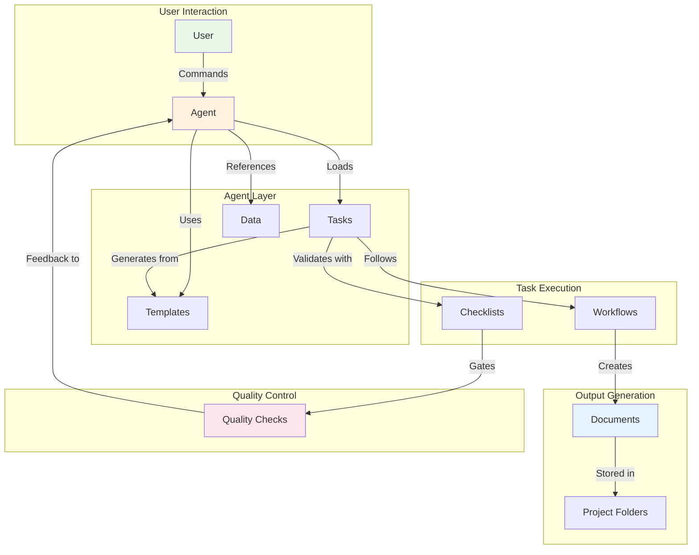
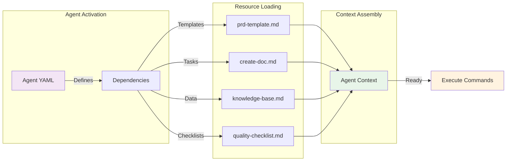

# 🚀 Agentic Engineer: The Augmented Intelligence Framework

<div align="center">

[](https://github.com/jakreymyers/agentic-engineer/stargazers)
[](LICENSE)
[](/.claude)
[](/.claude/context)

### **Orchestrate Multi-Agent AI Teams • Augment Human Intelligence • Deliver Real Results**

Transform how you work with AI by commanding specialized agent teams through structured workflows.
From software development to user research to content creation - achieve 10x productivity with quality control.

[🎯 Get Started](#-quick-start) • [📚 Documentation](docs/) • [🤝 Contributing](#-contributing) • [💬 Discussions](https://github.com/jakreymyers/agentic-engineer/discussions)

</div>

---

> **🎭 The "Vibe CEO" Approach**: Don't just prompt AI - orchestrate entire teams of specialized agents that work together, maintaining quality through systematic validation while you focus on strategy and creativity.

- Demonstrates practical application of AI agents in complex, multi-stage workflows
- Provides reusable patterns for template-driven development
- Shows how quality can be maintained through systematic elicitation and validation
- Creates framework for extending AI capabilities into new domains through expansion packs

This system provides a comprehensive foundation for AI-assisted work that maintains human oversight and quality control while maximizing the efficiency gains from AI automation.

## ✨ What's Inside

<table>
<tr>
<td width="50%">

### 🤖 **45+ Specialized AI Agents**
Production-ready agents across three domains:
- 🔧 **Software Development** (10 agents)
- 🔬 **User Research** (6 agents)
- ✍️ **Content Creation** (9 agents)
- 🚀 **More domains coming...**

</td>
<td width="50%">

### 📊 **Real-World Workflows**
Complete end-to-end processes:
- 💻 Full SDLC from planning to deployment
- 🎯 5 research methodologies with quality gates
- 📝 Content pipeline from ideation to publishing
- ✅ 400+ validation checkpoints

</td>
</tr>
<tr>
<td width="50%">

### 🎮 **Command & Control**
Intuitive orchestration system:
- 🎯 Simple `*agent` commands
- 📋 Task-driven execution
- 🔄 Automatic handoffs between agents
- 📈 Progress tracking & reporting

</td>
<td width="50%">

### 🛡️ **Quality Assurance**
Built-in safety & validation:
- ✨ Mandatory elicitation system
- 🎯 Measurable quality gates
- 🔍 Multi-phase checklists
- 🔄 Error recovery mechanisms

</td>
</tr>
</table>
  
## 🎯 Quick Start

```bash
# 1. Clone the repository
git clone https://github.com/jakreymyers/agentic-engineer.git

# 2. Navigate to project
cd agentic-engineer

# 3. Start using agents (with Claude)
*research-orchestrator  # Start user research
*bmad-master           # Software development
*content-editor        # Content creation
```

## 🏗️ Repository Structure

```
agentic-engineer/
├── .claude/                           # AI Agent Orchestration Framework
│   ├── commands/                      # Command definitions and routing
│   │   ├── bmad-core/                 # Development workflow commands
│   │   ├── content-creation/          # Content creation commands
│   │   └── general/                   # Universal utilities
│   ├── context/                       # Agent contexts and resources
│   │   ├── bmad-core/                 # Software development framework
│   │   │   ├── agents/                # Role-based specialists
│   │   │   ├── tasks/                 # Instructions for agents
│   │   │   ├── workflows/             # Task driven workflows
│   │   │   ├── templates/             # Project artifact templates
│   │   │   ├── checklists/            # Quality control checklists
│   │   │   └── data/                  # Knowledge bases
│   │   ├── content-creation/          # Content creation system
│   │   │   ├── agents/                # Content creation specialists
│   │   │   ├── tasks/                 # Content creation tasks
│   │   │   ├── workflows/             # Content workflows
│   │   │   ├── templates/             # Content templates
│   │   │   └── data/                  # Writing guides & examples
│   │   └── product-strategy/          # Future expansion area
│   └── hooks/                         # IDE lifecycle integration
├── apps/                              # Application code
│   ├── frontend/                    
│   └── backend/                     
├── docs/                              # Project documentation
│   ├── ai-docs/                       # AI tools & services docs
│   ├── discovery/                     # Project briefs & research artifacts
│   ├── ux/                            # UX specs & design documents
│   ├── prd/                           # Sharded PRD epic files
│   ├── architecture/                  # Sharded architecture files
│   ├── stories/                       # Implementation story files
│   └── qa/                            # Quality assurance documents
│       ├── assessments/               # Risk, NFR, and trace reports
│       └── gates/                     # Quality gate decisions
└── reports/                           # Agent execution reports
```

## 🚀 Quick Start Guide

### 1. Installation & Setup

The framework requires installation in your project's `.claude` directory:

```bash
# Copy the .claude directory from this repo
cp -r /path/to/agentic-engineer/.claude ./
```

### 2. Choose Your Workflow

The system provides two main frameworks:

- #### 🏗️ **BMAD-Core: Software Development**
  For building applications with AI agent assistance.
  Based on [BMAD-METHOD](https://github.com/bmad-code-org/BMAD-METHOD) by Brian Madison.

- #### 📝 **Content-Creation: Thought Leadership**
  For creating LinkedIn posts, blog articles, and marketing content.

## 🏗️ BMAD-Core Development Framework

### Core Philosophy: **Agent Specialization with Clean Handoffs**

Transform ineffective AI coding slop into structured AI-assisted development through specialized agents and workflows

### Development Agents (10 Specialists)

| Agent | Role | Specialization |
|-------|------|----------------|
| **analyst** | 🔍 Research | Market research, competitive analysis, requirements gathering |
| **pm** | 🎯 Product Strategy | PRD creation, feature prioritization, stakeholder communication |
| **ux-expert** | 🎨 User Experience | UI/UX design, frontend specs, user journey mapping |
| **architect** | 🛠️ System Design | Technical architecture, technology selection, system design |
| **po** | ✅ Product Owner | Backlog management, validation, cross-document consistency |
| **sm** | 📝 Scrum Master | Story creation, sprint planning, team coordination |
| **dev** | 💻 Development | Code implementation, testing, documentation |
| **qa** | 🧪 Quality Assurance | Test architecture, code review, quality gates |
| **bmad-master** | 👑 Universal | All agent capabilities for flexible execution |
| **bmad-orchestrator** | 🎭 Conductor | Team coordination, workflow management |

### Key BMAD Commands Reference

| Agent | Key Commands | Purpose |
|-------|-------------|----------|
| **analyst** | `*brainstorm {topic}`, `*create-project-brief`, `*create-competitor-analysis`, `*research-prompt {topic}` | Research & discovery |
| **pm** | `*create-prd`, `*create-brownfield-prd`, `*create-brownfield-story`, `*create-brownfield-epic` | Product planning |
| **architect** | `*create-full-stack-architecture`, `*document-project`, `*create-backend-architecture` | System design |
| **po** | `*shard-doc {doc} {dest}`, `*validate-story-draft {story}`, `*execute-checklist-po`, `*correct-course` | Validation & sharding |
| **sm** | `*draft`, `*story-checklist`, `*correct-course` | Story creation |
| **dev** | `*develop-story`, `*run-tests`, `*review-qa`, `*explain` | Implementation |
| **qa** | `*risk-profile {story}`, `*test-design {story}`, `*review {story}`, `*gate {story}`, `*trace {story}`, `*nfr-assess {story}` | Quality assurance |
| **ux-expert** | `*create-front-end-spec`, `*generate-ui-prompt` | UI/UX design |

### Greenfield Development (New Projects)

#### Discovery Phase

**Primary Goal:** Create research & analysis artifacts to generate the project brief

1. **Initial Brainstorming** (`/analyst`)
   - `*brainstorm` to elicit ideas and details

2. **Project Research** (`/analyst`)
   - `*research-prompt` for general research
   - `*create-competitor-analysis` and `*perform-market-research` for specific research

3. **Project Brief Creation** (`/analyst`)
   - `*create-project-brief` to create primary artifact for analysis phase

#### Definition Phase

**Primary Goal:** Generate product requirements (PRD), UX design, and technical strategy documents

1. **Product Requirements** (`/pm`)
   - `*create-prd` to create product requirements from the project brief

2. **UX Design** (`/ux-expert`) - Optional
   - `*create-front-end-spec` to create UX and design specifications

3. **System Architecture** (`/architect`)
   - `*create-full-stack-architecture` to create a full-stack system design document

#### Planning Phase

**Primary Goal:** Validate document alignment, shard artifacts into manageable pieces, and prepare for development execution

1. **Document Validation** (`/po`)
   - `*execute-checklist-po` to run master checklist validation
   - Use `*correct-course` to identify and resolve issues
   - Update PRD/Architecture as needed through respective agents (`/architect`, `/ux-expert`, etc)

2. **Document Sharding** (`/po`)
   - `*shard-doc docs/prd.md docs/prd` to break PRD into epic files
   - `*shard-doc docs/architecture.md docs/architecture` to break architecture into manageable sections

#### Development Phase

**Primary Goal:** Execute story-driven development with comprehensive testing and continuous validation

1. **Story Creation** (`/sm`)
   - `*draft` to create integrated story file with technical details
   - `*story-checklist` to validate story draft quality
   - Update status from "Draft" to "Approved"

2. **Story Implementation** (`/dev`)
   - `*develop-story {approved-story}` to execute sequential task implementation
   - `*run-tests` to execute linting and full test suite


#### Validation Phase

**Primary Goal:** Comprehensive quality assessment with risk-based testing and quality gates

1. **Comprehensive Review** (`/qa`)
   - `*review {story}` for full assessment and story verification
   - Creates quality gate decision (PASS/CONCERNS/FAIL/WAIVED)

2. **Fix Integration** (`/dev`)
   - `*review-qa` to apply QA fixes when needed
   - Re-run validation cycle until quality gate passes

3. **Story Completion**
   - Verify all tests pass and quality gate is satisfactory
   - Mark story as "Done"

#### Integrating Development & Testing Phases

**QA commands can be used at different stages based on story complexity and risk:**

- **Before Development** (High-risk/complex stories): `*risk-profile {story}`, `*test-design {story}`
- **During Development** (Mid-implementation checks): `*trace {story}`, `*nfr-assess {story}`
- **After Development** (Required): `*review {story}` for comprehensive assessment
- **Post-Review** (As needed): `*gate {story}` to update quality gate status

### Brownfield Development (Existing Projects)

**Primary Goal:** Enhance existing systems with new features while maintaining system integrity and minimizing risk

#### Discovery Phase

**Primary Goal:** Classify enhancement scope and determine appropriate workflow path

1. **Enhancement Classification** (`/analyst`)

   - **Single story** → Use `*brownfield-create-story`
   - **Small feature** → Use `*brownfield-create-epic`
   - **Large feature** → Use `*document-project` + `*create-prd`

#### Planning Phase

**Primary Goal:** Create appropriate planning artifacts based on enhancement scope

1. **For Single Stories** (`/pm`)
   - `*create-brownfield-story` for immediate implementation

2. **For Small Features** (`/pm`)
   - `*create-brownfield-epic` for a focused epic with 1-3 stories

3. **For Major Enhancements**
   - **Documentation Check**: Assess if adequate project documentation exists
   - **Project Analysis** (if needed): `/architect` `*document-project` to capture current system state
   - **PRD Creation**: Use `/pm` to `*create-prd` plan for major enhancements
   - **Validation**: Use `/po` to `*execute-checklist-po` and validate artifacts
   - **Document Sharding**: Use `/po` to `*shard-doc {doc} {destination}` and prepare for development

#### Development Phase

**Primary Goal:** Execute story-driven development following existing system patterns

1. **Story Creation** (`/sm` - Scrum Master Bob)
   - `*draft` to execute stories or work directly with brownfield stories/epics from planning
   - `*story-checklist` to validate story draft quality

2. **Optional Risk Assessment** (High-risk brownfield changes)
   - `/qa` to activate Test Architect Quinn
   - `*risk-profile {story}` to assess regression risks
   - `*test-design {story}` to create test strategy focused on existing system protection

3. **Story Validation** (Optional)
   - `/po` to activate Product Owner Sarah
   - `*validate-story-draft {story}` to ensure story aligns with existing system constraints

4. **Implementation** (`/dev` - Developer James)
   - `*develop-story` with focus on existing system patterns
   - Emphasizes regression prevention and existing functionality preservation
   - `*run-tests` with particular attention to regression test suite

#### Development & Testing Phase

**Primary Goal:** Execute story-driven development with comprehensive testing and continuous validation

1. **Story Creation** (`/sm` - Scrum Master Bob)
   - `*draft` to execute the create-next-story task
   - Reviews previous story insights and architecture context
   - Creates comprehensive story file with technical details
   - `*story-checklist` to validate story draft quality

2. **Optional Risk Assessment** (High-risk stories)
   - `/qa` to activate Test Architect Quinn
   - `*risk-profile {story}` to assess implementation risks
   - `*test-design {story}` to create comprehensive test strategy

3. **Story Validation** (Optional)
   - `/po` to activate Product Owner Sarah
   - `*validate-story-draft {story}` to ensure story aligns with requirements

4. **Implementation** (`/dev` - Developer James)
   - `*develop-story` to execute sequential task implementation
   - Follows order: Read task → Implement → Write tests → Execute validations → Update checkboxes
   - Mid-development QA checks (optional):
     - `/qa` `*trace {story}` for test coverage validation
     - `/qa` `*nfr-assess {story}` for non-functional requirements check
   - `*run-tests` to execute linting and full test suite
   - Mark story as "Ready for Review" when complete

#### Validation Phase

**Primary Goal:** Comprehensive quality assessment with emphasis on system integrity and regression prevention

1. **Comprehensive Review** (`/qa`)
   - `*review {story}` with focus on brownfield concerns

2. **Quality Gate Management** (`/qa`)
   - `*gate {story}` decisions prioritize system integrity
   - Special attention to backward compatibility & regression testing validation

3. **Fix Integration & Story Completion** (`/dev`)
   - `*review-qa` to address brownfield-specific concerns
   - Verify all existing functionality remains intact

### File Structure After Setup

```
your-project/
├── docs/
│   ├── prd.md                    # Product Requirements Document
│   ├── architecture.md           # Technical Architecture
│   ├── prd/                      # Sharded epic files
│   │   ├── index.md              # PRD overview with section links
│   │   ├── epic-1-user-auth.md
│   │   └── epic-2-dashboard.md
│   ├── architecture/             # Sharded architecture files
│   │   ├── index.md
│   │   ├── tech-stack.md
│   │   ├── coding-standards.md
│   │   └── testing-strategy.md
│   ├── stories/                  # Implementation stories
│   │   ├── 1.1.story.md          # Epic 1, Story 1
│   │   └── 1.2.story.md          # Epic 1, Story 2
│   └── qa/                       # Quality assessments
│       ├── assessments/          # Risk, NFR, and trace reports
│       └── gates/                # Quality gate decisions
```

## 📝 Content Creation Framework

### Philosophy: **Augmented Intelligence for Thought Leadership**

Create authentic, high-performing content that builds authority while maintaining human voice and avoiding AI detection.

### Content Agents (8 Specialists)

| Agent | Persona | Specialization |
|-------|---------|----------------|
| **thought-partner** | 🧠 Maya Patel | Strategic thinking, intellectual sparring, framework development |
| **linkedin-writer** | 📱 Alex Chen | Viral LinkedIn content, engagement optimization, platform mastery |
| **blog-writer** | ✍️ Sarah Kim | Long-form content, technical storytelling, narrative structure |
| **content-editor** | ✂️ Marcus Johnson | Quality enforcement, voice consistency, clarity optimization |
| **hook-optimizer** | 🪝 Jessica Liu | Viral mechanics, attention capture, engagement psychology |
| **microsaas-advisor** | 🚀 Rachel Martinez | Solopreneur journey, product launch narratives, authenticity |
| **data-product-writer** | 📊 David Thompson | Technical translation, healthcare expertise, B2B storytelling |
| **narrative-architect** | 🎭 James Rodriguez | Brand story, long-term content strategy, multi-platform coherence |

### Content Workflows

#### Ideation Phase

1. `/thought-partner` - Strategic thinking with Maya Patel
   - `*brainstorm` - Generate and explore ideas
   - `*stress-test` - Pressure test concepts
   - `*angle` - Find unique perspective
   - `*challenge` - Devil's advocate mode

#### Creation Phase

1. **LinkedIn Content** (`/linkedin-writer` - Alex Chen)
   - `*create-post` - Write new LinkedIn post
   - `*optimize-hook` - Create hook variations
   - `*viral-check` - Assess engagement potential

2. **Blog Articles** (`/blog-writer` - Sarah Kim)
   - `*create-article` - Write comprehensive blog
   - `*outline` - Structure the article
   - `*seo-optimize` - Optimize for search

3. **MicroSaaS Content** (`/microsaas-advisor` - Rachel Martinez)
   - `*product-story` - Craft product narrative
   - `*journey-update` - Document progress
   - `*revenue-story` - Share metrics       


#### Optimization Phase

1. **Content Editing** (`/content-editor` - Marcus Johnson)
   - `*edit-ruthlessly` - Apply writing principles
   - `*passive-hunt` - Remove passive voice
   - `*jargon-kill` - Eliminate jargon

2. **Hook Optimization** (`/hook-optimizer` - Jessica Liu)
   - `*optimize` - Improve hooks
   - `*viral-check` - Assess viral potential
   - `*jak-tune` - Match Jak's voice


#### Distribution Phase

**Narrative Architecture** (`/narrative-architect` - James Rodriguez)
- `*series-arc` - Plan content series
- `*brand-story` - Ensure consistency
- `*content-calendar` - Schedule publishing


### Content Commands Reference

| Agent | Commands | Purpose |
|-------|----------|----------|
| **thought-partner** | `*brainstorm`, `*stress-test`, `*angle`, `*challenge` | Ideation |
| **linkedin-writer** | `*create-post`, `*optimize-hook`, `*viral-check` | LinkedIn content |
| **blog-writer** | `*create-article`, `*outline`, `*seo-optimize` | Blog posts |
| **microsaas-advisor** | `*product-story`, `*journey-update`, `*revenue-story` | Product content |
| **content-editor** | `*edit-ruthlessly`, `*passive-hunt`, `*jargon-kill` | Editing |
| **hook-optimizer** | `*optimize`, `*viral-check`, `*jak-tune` | Engagement |
| **narrative-architect** | `*series-arc`, `*brand-story`, `*content-calendar` | Strategy |
| `*timing-optimization` | Find best publish times |
| `*engagement-plan` | Create interaction strategy |


## 🎯 How Files Connect: System Integration

### Template → Task → Agent → Workflow Connection



### Agent Dependency Resolution



## 🔧 Advanced Features

### Multi-Agent Collaboration

**Party Mode**: Multiple agents working together
```
*party-mode
```
Coordinate multiple agents on complex tasks with shared context.

**Background Agents**: Long-running tasks
```
*background-agent "complex analysis task"
```
Spin up autonomous agents for time-intensive work.

---
Test: Normal git operations after history cleanup
